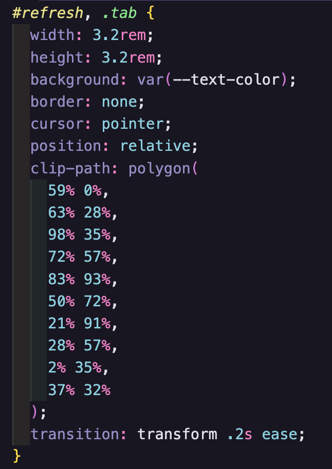

# Reflectie Minor Web

## Dagelijkse vragen

**Wat heb ik vandaag gedaan:**
**Hoelang duurde het:**
**Wat heb ik geleerd:**
**Wat ga ik morgen doen:**

---

## Week 1

### Dag 1 – Dinsdag

Kickoff!!
Aan het ontwerp gewerkt voor de website en een klein stukje code geschreven.

### Dag 2 – Woensdag

**Wat heb ik vandaag gedaan:**
API 1 en 2 gevolgd. Verder aan mijn website gewerkt, maar ik was moe dus ik heb niet super veel gedaan. Vooral in oudere code gekeken om er weer in te komen.

**Hoelang duurde het:**
Workshops waren 2,5 uur en de rest van de dag aan de website.

**Wat heb ik geleerd:**
De basics van API’s en requestAnimationFrame in JavaScript.

**Wat ga ik morgen doen:**
Meer aan mijn website werken en mijn JavaScript beter begrijpen. Jeppe wachtwoord vragen.

---

### Dag 3 – Donderdag

**Wat heb ik vandaag gedaan:**
Ik ben opnieuw begonnen aan mijn site omdat ik mijn idee had omgegooid. Ik werkte aan de HTML drag & drop en animaties van afbeeldingen.

**Hoelang duurde het:**
Naast workshops en pauzes de hele dag, maar ik moest wel eerder weg.

**Wat heb ik geleerd:**
Drag & Drop API, animaties met keyframes en media queries voor light/dark mode en high contrast.

**Wat ga ik morgen doen:**
Verder werken aan de site.

---

### Dag 4 – Vrijdag

**Wat heb ik vandaag gedaan:**
Verder gewerkt aan de website, vooral aan de pick & drop afbeeldingen in Illustrator en de vakantie-foto animatie.

**Hoelang duurde het:**
Hele dag.

**Wat ga ik maandag doen:**
API verwerken in de website.

---

### Reflectie Week 1

De eerste week was vooral weer even inkomen. Ik had bijna een jaar niet gecodeerd, dus ik merkte dat ik best veel basis weer een beetje vergeten was. Daardoor voelde de start wat traag en moest ik echt opnieuw in het ritme komen. Gelukkig merkte ik gedurende de week dat het steeds weer begon terug te komen.

Voordat ik begon met coderen had ik een paar ontwerpen gemaakt voor mijn website zodat ik een richting had. In de praktijk merkte ik alleen dat ik daar bijna niet meer naar keek en vooral al bouwend keuzes maakte in de browser. Dat is iets waar ik later beter over wil nadenken zodat mijn ontwerpproces beter aansluit op mijn ontwikkelproces.

Op woensdag volgde ik de API workshops en keek ik veel in oudere code om weer te begrijpen hoe dingen werkten.
Donderdag gooide ik mijn idee om en begon ik opnieuw aan mijn website. Dat kostte tijd, maar voelde wel als de juiste keuze. Ik werkte aan HTML, drag & drop en animaties.
Vrijdag werkte ik verder aan de pick & drop afbeeldingen die ik in Illustrator maakte.

Wat ik deze week vooral heb geleerd is dat het oké is om opnieuw te beginnen en dat iteratief werken onderdeel is van het proces. Mijn JavaScript begrip begint weer terug te komen.

Een belangrijk verbeterpunt voor mezelf is dat ik mijn proces beter moet bijhouden. Ik wil vaker screenshots maken van mijn code en tussenstappen zodat mijn reflecties duidelijker worden en ik beter kan terugzien hoe mijn project is verlopen.

---

## Week 2

### Dag 5 – Maandag

**Wat heb ik vandaag gedaan:**
Een klein lesje API inladen opnieuw gevolgd en dit toegepast in mijn website. Verder de hele dag aan de site gewerkt.

**Wat heb ik geleerd:**
API inladen.

**Wat ga ik morgen doen:**
Website persoonlijker maken en code checken.

---

### Dag 6 – Dinsdag

Workshop typografie:

* Fonts en licenties
* Font fallbacks
* WOFF2 format
* Line-height
* Ideale tekstbreedte (20–40em)
* Breakpoints
* CSS text mask
* CSS nesting

JavaScript:

* RSS feed (Letterboxd)
* Promise chains
* slice()
* Fetch API

**Wat heb ik vandaag gedaan:**
API verder verwerkt in mijn website.

**Wat heb ik geleerd:**
JavaScript functies korter schrijven en beter werken met API’s.

**Wat ga ik morgen doen:**
Vormgeving en TMDB database koppelen aan student API.

---

### Dag 7 – Woensdag

Code check:

* Consistente naamgeving
* Dubbele CSS opschonen
* :root variabelen uitbreiden
* Alt teksten toevoegen
* Lege HTML tags checken
* Font formats aanpassen

**Wat heb ik vandaag gedaan:**
Verder gewerkt aan de code en een beetje aan de vormgeving.

**Wat heb ik geleerd:**
Polygon clippath in CSS.

**Wat ga ik morgen doen:**
README aanvullen.

---

### Reflectie Week 2

In week 2 voelde ik me al een stuk meer terug in het coderen en kon ik me meer focussen op API’s en het persoonlijker maken van mijn website.

Maandag heb ik opnieuw geoefend met het inladen van een API en dit meteen toegepast. Ik probeerde vooral beter te begrijpen wat er gebeurt wanneer je data ophaalt en gebruikt in JavaScript.

Tijdens de typografie workshop leerde ik over fontlicenties, fallbacks, WOFF2, line-height en ideale tekstbreedte. Daarnaast werkte ik verder met API’s, promise chains en slice().

Woensdag deed ik een code check en werkte ik aan consistente naamgeving, het opschonen van CSS en het toevoegen van alt teksten. Ook leerde ik clip-path gebruiken in CSS voor een stervormige knop.

Een belangrijk onderdeel van deze week was het werken met Letterboxd data. Letterboxd heeft geen officiële API maar wel een RSS-feed in XML. Omdat XML lastig direct te gebruiken is in JavaScript heb ik dit omgezet naar JSON met een rss2json API. Hierdoor kan ik dynamisch filmdata op mijn site tonen.
